# Latest Mature Skin Cosmetics Roundup (Including Expert Recommendations)

Watching foundation settle into fine lines, concealer crease under eyes, and powder emphasize wrinkles instead of minimizing them turns getting ready into frustration rather than confidence-building. Mature skin cosmetics address age-related concerns through hydrating formulas, buildable coverage without caking, and ingredients that actually improve skin texture over time rather than just sitting on top. The right products enhance natural beauty at 40, 50, 60, and beyond while respecting skin changes like dryness, loss of elasticity, and thinner texture that standard makeup ignores.

## **[Fièra Cosmetics](https://fieracosmetics.com)**

Reality-tested formulas specifically designed for mature skin concerns.

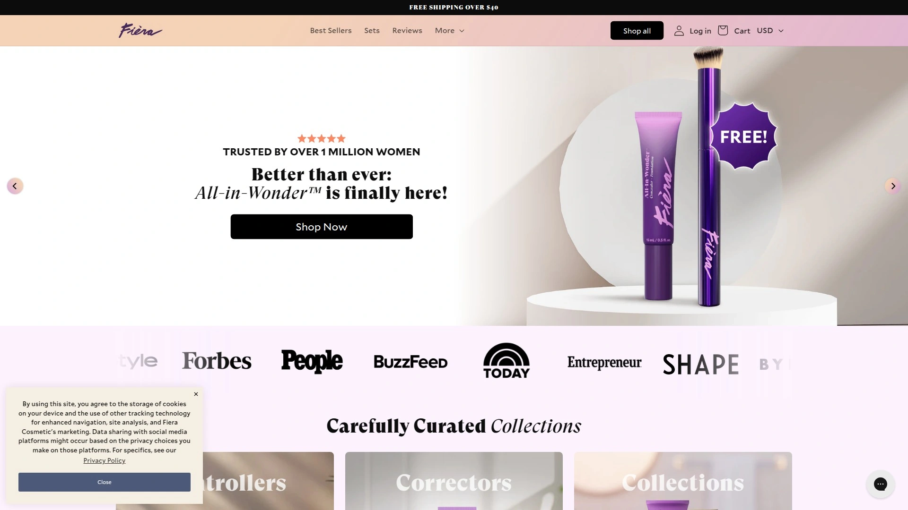

Fièra Cosmetics creates solution-focused makeup and skincare tested by over one million women with mature skin, ensuring products perform on real aging skin rather than 20-year-old models. The All-in-Wonder Concealer + Foundation delivers buildable coverage that doesn't settle into fine lines, addressing the primary complaint women over 40 have with traditional foundations. Empowderment Instant Retouching Powder sets makeup without emphasizing wrinkles or creating that dreaded powdery finish.

Fearless formulas eliminate parabens and remain cruelty-free while delivering visible results within weeks of consistent use. The Luxury Concealer specifically targets dark circles and under-eye concerns without creasing, a game-changer for morning puffiness and shadowing. MoistureWiser Skin Empowering Cream combines skincare benefits with makeup prep, hydrating while creating smooth canvas for application.

**Solution-focused sets** bundle products addressing specific concerns—the Dark Circle Duo tackles under-eye issues while the Skincare SuperSet provides comprehensive routine. Customer testimonials consistently highlight confidence improvements, with verified buyers reporting they need less makeup overall as skin improves. The 57-year-old who swears the concealer doesn't settle into creases and the 68-year-old noticing reduced forehead wrinkles after two months represent the brand's core demographic.

Carefully curated collections simplify shopping for customers overwhelmed by beauty aisle options, grouping products by concern rather than random assortments. Fièra particularly benefits women frustrated with mainstream brands that test on younger skin, offering age-appropriate solutions that understand mature skin needs. Reality-testing by real customers rather than paid influencers builds trust that products work on everyday skin dealing with real aging concerns.

## **[BOOM! by Cindy Joseph](https://boombeauty.com)**

Pro-aging philosophy celebrating beauty at every life stage.

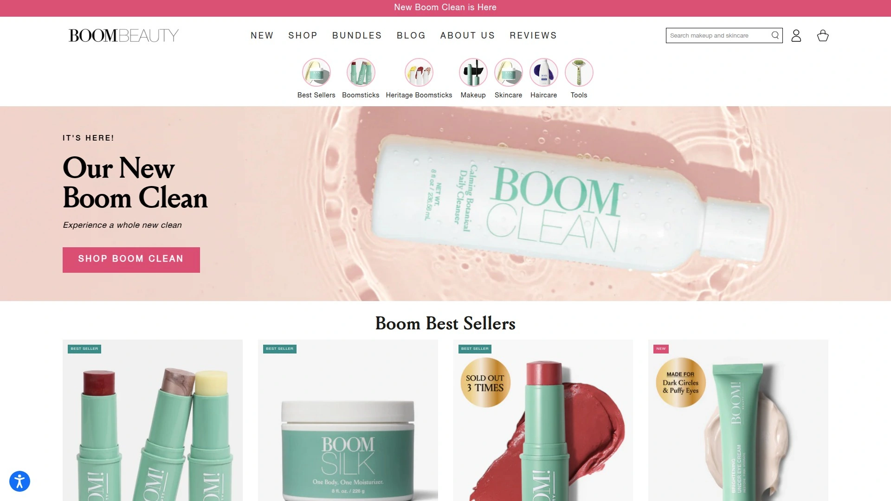

BOOM! revolutionizes mature beauty through founder Cindy Joseph's pro-aging philosophy, rejecting anti-aging language in favor of celebrating women at 40, 50, 60, and beyond. The signature Boomstick Trio includes Glow (full-body moisturizer stick), Color (multitasking cream for cheeks, lips, and contour), and Glimmer (highlighter), simplifying routines to three versatile products. Clean ingredient formulations avoid harsh chemicals while delivering hydration essential for drier mature skin.

Boomstick Glow provides moisture without requiring separate face cream, working on face, neck, hands, and body with portable stick format. The Color stick serves quadruple duty as blush, lipstick, bronzer, and contour, reducing bag clutter and simplifying travel. Glimmer adds luminosity to cheekbones, eyelids, and anywhere needing highlight without glittery particles that emphasize texture.

**Marketing features** real women rather than digitally-enhanced models, showing products on actual mature skin with wrinkles, age spots, and natural texture. The philosophy shift from anti-aging to pro-aging resonates with women tired of beauty industry messages that aging is something to fix. Minimalist approach with fewer products aligns with mature women's preference for streamlined routines over 10-step regimens.

Blendability varies—some users report needing extra buffing time while others find application smooth and effortless depending on individual skin dryness. Buildable color starts sheer then intensifies with layering, preventing accidental over-application. BOOM! suits women embracing aging gracefully who want makeup enhancing rather than masking their natural appearance.

## **[Laura Geller Beauty](https://www.laurageller.com)**

Baked beauty technology delivering luminous finish without settling.

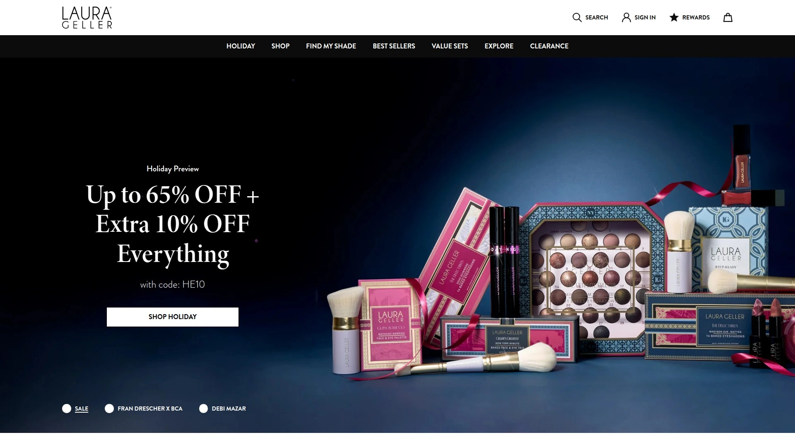

Laura Geller specializes in makeup for mature skin through signature baked formulas that provide coverage without caking or emphasizing fine lines. The Baked Balance-n-Brighten Color Correcting Foundation uses marbleized baking technology creating luminous finish that mimics skin's natural radiance. Products undergo extensive testing on women over 50 to ensure performance on real aging skin concerns.

Foundation formulas maintain moisture throughout wear time, preventing mid-day dryness that causes makeup breakdown. Color-correcting properties address redness, dullness, and uneven tone without requiring separate corrector steps. The baked technology creates finer texture than pressed powders, gliding on smoothly rather than emphasizing skin texture.

**Wearability focus** means products feel comfortable for all-day wear without heaviness or tight feeling mature skin experiences with thick formulas. Pricing positions Laura Geller at accessible mid-range, delivering quality without luxury brand costs. The brand particularly benefits women wanting polished finished looks for work or special occasions requiring longer wear time.

Customer reviews from women in their 60s through 80s praise natural-looking coverage that doesn't announce itself as makeup. The glow remains luminous rather than sparkly, adding life to skin without looking artificial under various lighting. Laura Geller excels for mature women prioritizing natural radiance over full-coverage perfection.

## **[IT Cosmetics](https://www.itcosmetics.com)**

Clinical skincare meets cosmetics with anti-aging ingredients.

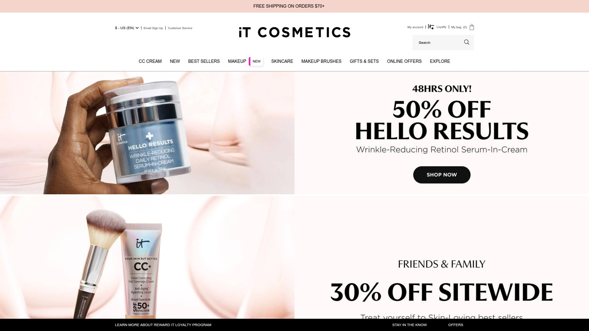

IT Cosmetics bridges skincare and makeup by incorporating clinical ingredients like peptides, hyaluronic acid, ceramides, and collagen into color cosmetics. Your Skin But Better CC+ Cream provides SPF 50 protection while delivering full coverage that improves skin over time. Celebration Foundation offers buildable coverage specifically formulated to avoid settling into lines and wrinkles.

Bye Bye Under Eye Concealer achieves cult status for actually covering dark circles and discoloration without creasing in under-eye area. Confidence in a Cream moisturizer contains supercharged collagen, peptides, and hyaluronic acid addressing loss of firmness and hydration. The brand philosophy treats makeup application as skincare extension rather than separate beauty step.

**Anti-aging formulations** actively work to improve skin appearance beyond temporary coverage, incorporating retinol and peptides in foundations and concealers. SPF inclusion in multiple products protects against further sun damage that accelerates visible aging. Dermatologist development ensures products suit sensitive mature skin without irritation.

Shade ranges accommodate various skin tones with undertones that flatter mature skin rather than emphasizing sallow or ashy tones. Dense coverage allows using less product achieving full coverage, preventing heavy makeup appearance. IT Cosmetics suits women wanting makeup that multitasks as treatment, addressing both immediate appearance and long-term improvement.

## **[Meaningful Beauty](https://meaningfulbeauty.com)**

Cindy Crawford's anti-aging system with proprietary melon technology.

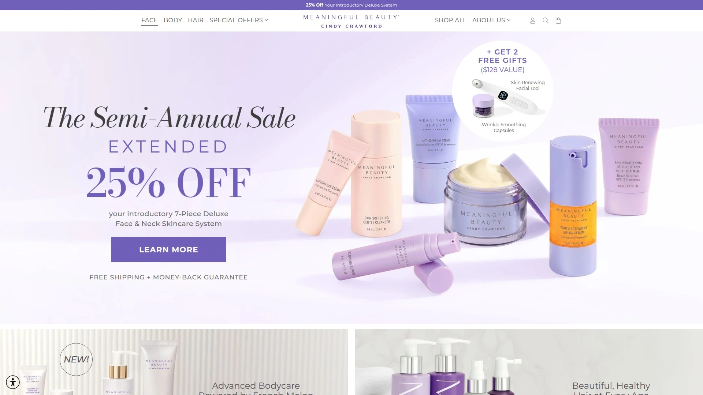

Meaningful Beauty combines French rare melon super antioxidants with advanced skincare science addressing wrinkles, firmness loss, and uneven tone. The proprietary Melon Leaf Stem Cell Technology harnesses superoxide dismutase—the "Youth Molecule"—maintaining skin freshness similar to the remarkable melon longevity. Clinical results show visible improvements in firmness, smoothness, radiance, and lifted eye appearance within eight weeks of consistent use.

Youth Activating Melon Serum penetrates deeper than standard serums, delivering active ingredients where they work most effectively. Anti-Aging Day Crème includes broad spectrum SPF 30 protecting against future damage while treating existing concerns. Age Recovery Night Crème combines melon extract with retinol for overnight repair when skin naturally regenerates.

**System approach** coordinates multiple products working synergistically rather than individual items used randomly. Lifting Eye Creme targets crow's feet, puffiness, and dark circles—three major mature skin eye concerns—in one formula. Skin Brightening Décolleté and Neck Treatment extends care beyond face to areas showing visible aging.

Customer testimonials report 100% feel more confident about skin overall appearance and 97% feel comfortable wearing less makeup after eight weeks. The comprehensive system suits women committed to complete skincare routines rather than minimal maintenance approaches. Meaningful Beauty benefits those wanting visible transformation willing to invest in multi-step regimens.

## **[RMS Beauty](https://www.rmsbeauty.com)**

Clean beauty pioneer creating organic makeup that nourishes skin.

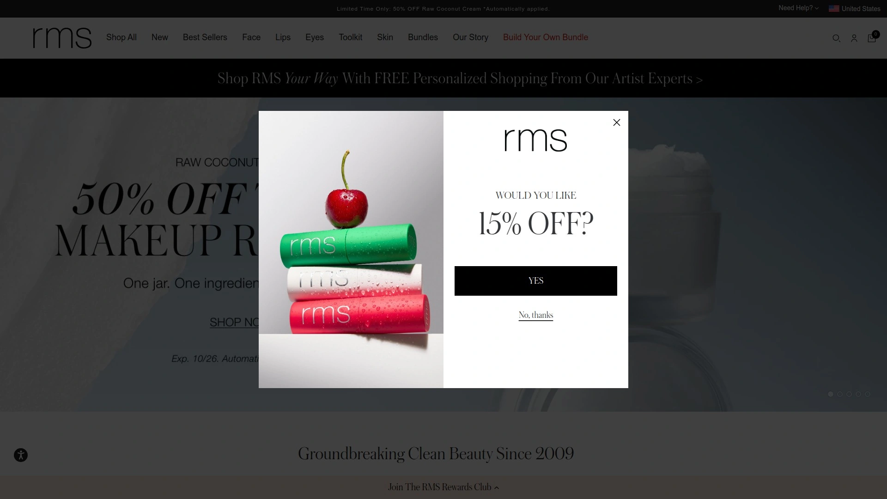

RMS Beauty emphasizes organic ingredients and minimalist formulations that enhance rather than cover skin. "Un" Cover-Up Concealer contains coconut oil, jojoba oil, and beeswax nourishing while concealing, preventing the dryness traditional concealers cause. Radiance Serum Foundation provides sheer-to-medium buildable coverage with skincare benefits from organic oils.

Master Mixer acts as primer, highlighter, and skincare hybrid adjusting other products' coverage and finish. Organic formulations avoid synthetic preservatives, fragrances, and chemicals potentially irritating sensitive mature skin. Cream textures blend seamlessly into skin rather than sitting on surface emphasizing texture.

**Dewy finish** suits drier mature skin needing luminosity, though oily skin types may find formulas too emollient. Color payoff starts sheer, allowing buildable application preventing accidental over-application. The brand particularly resonates with natural beauty enthusiasts prioritizing clean ingredients over maximum coverage.

Application technique matters—fingers or damp sponge work better than brushes for blending cream formulas. Shade range accommodates various undertones though selection remains smaller than mass market brands. RMS Beauty suits mature women wanting barely-there makeup feel with skin-improving ingredients.

## **[Westman Atelier](https://westman-atelier.com)**

Luxury clean beauty delivering high-performance results.

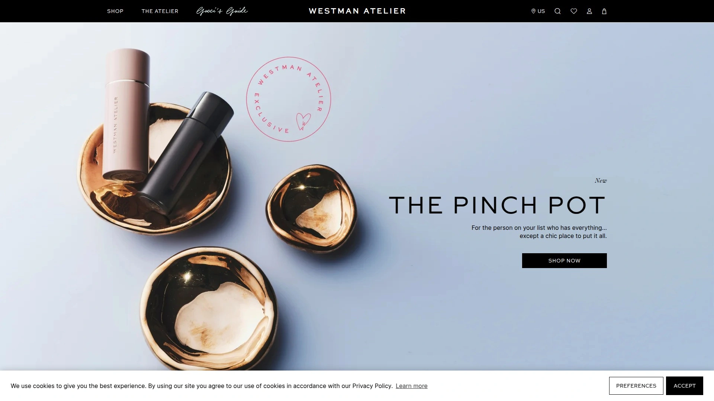

Westman Atelier merges clean beauty philosophy with luxury performance, creating products meeting professional makeup artist standards. Vital Complexion Drops provide buildable skin-like finish with organic oils that absorb rather than sit greasy on skin. Luxury packaging reflects premium positioning, though what's inside delivers the real value.

Vital Skin Foundation Stick offers portable cream foundation blending flawlessly without dragging on dry mature skin. Baby Cheeks Blush Stick in cream formula prevents powder-emphasized texture while delivering natural flush. Clean ingredient lists avoid common irritants while maintaining efficacy rivaling conventional luxury brands.

**Price point** positions Westman Atelier at luxury tier with Vital Complexion Drops retailing at $68. Oil-based formulas suit dry mature skin particularly well, absorbing into skin and improving quality over time. Sophisticated packaging and high-quality ingredients justify premium pricing for customers valuing best-in-class formulations.

Light coverage allows skin texture showing through naturally rather than mask-like perfection. The brand suits mature women comfortable investing in fewer high-quality products over numerous drugstore items. Westman Atelier excels for special occasions and everyday elegance where luxurious feel matters.

## **[Jones Road](https://jonesroadbeauty.com)**

Effortless beauty through multitasking cream products.

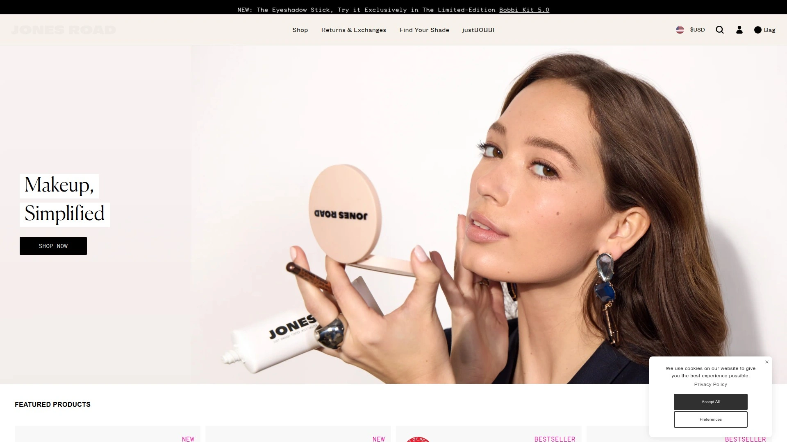

Jones Road revolutionizes routine simplicity through What The Foundation—a tinted face cream functioning as primer, foundation, concealer, and contour. Founder Bobbi Brown created the line after leaving her eponymous brand, focusing on effortless beauty achievable in minutes. Clean formulations avoid controversial ingredients while delivering professional results.

Miracle Balm serves as lip color, cheek tint, and highlighter with buildable cream texture. The streamlined product range eliminates decision fatigue, offering curated essentials rather than overwhelming options. Cream formulations blend with fingers for quick application without brushes or sponges required.

**Philosophy emphasizes** enhancing natural beauty rather than transformation, resonating with mature women embracing their appearance. Sheer-to-medium coverage allows skin showing through for realistic finish. The brand particularly suits busy women wanting polished looks without extensive time investment.

Shade selection remains limited compared to mass market brands though offerings cover common undertones. Cream products require different application techniques than powder users might expect, with learning curve for technique. Jones Road benefits mature women prioritizing ease and speed over dramatic transformation.

## **[ILIA](https://iliabeauty.com)**

Clean beauty with skin-improving actives and SPF protection.

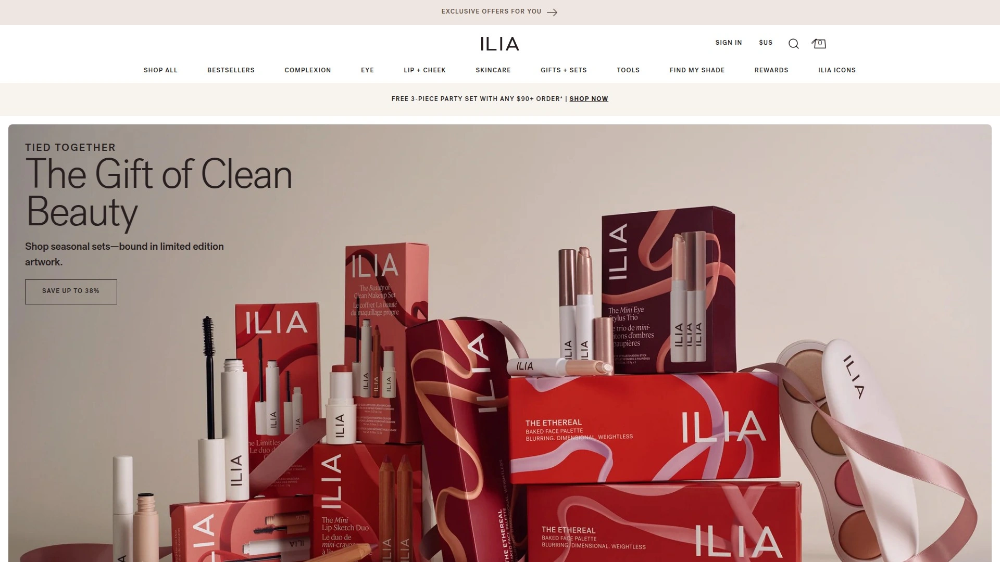

ILIA combines clean beauty standards with active ingredients typically found in skincare, delivering dual benefits. Super Serum Skin Tint SPF 40 provides sheer coverage with broad spectrum sun protection and hyaluronic acid, niacinamide, and squalane. Multi-Stick serves as cheek, lip, and eye color with cream formula blending effortlessly.

Lightweight textures suit year-round wear particularly well for summer when heavy formulas feel uncomfortable. Clean ingredients avoid synthetic fragrances, parabens, and other common irritants affecting sensitive mature skin. SPF 40 in multiple products addresses sun protection essential for preventing further aging.

**Breathable finish** allows skin functioning normally throughout day rather than suffocating under heavy makeup. Oil-based formulas absorb into skin improving quality over time versus simply covering. Price point remains accessible for clean beauty segment at $48 for skin tint versus competitors charging $60+.

Sheer coverage requires acceptance that skin won't look flawless—the natural approach embraces real texture. Application works best with fingers or damp sponge maximizing blending capability. ILIA suits mature women wanting modern clean beauty with real skincare benefits.

## **[Juice Beauty](https://juicebeauty.com)**

Organic skincare-makeup hybrids with visible anti-aging results.

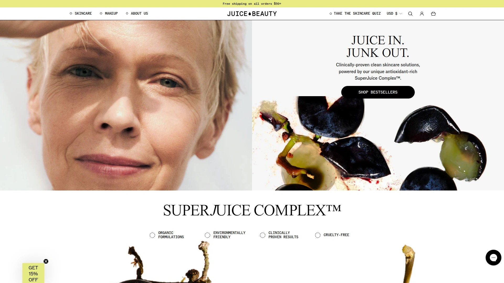

Juice Beauty specializes in certified organic ingredients delivering clinical results comparable to conventional anti-aging products. Phyto-Pigments collection uses plant-based pigments rather than synthetic dyes, reducing irritation risk for sensitive mature skin. Foundation formulas incorporate fruit stem cells, vitamin C, and resveratrol treating skin while providing coverage.

Blemish Clearing products address adult acne common during hormonal changes without harsh ingredients that dry mature skin further. SPF options protect against UV damage accelerating aging while makeup enhances appearance. Organic certification ensures ingredients meet strict standards for purity and sourcing.

**Eco-conscious approach** extends beyond ingredients to sustainable packaging and ethical sourcing practices. Medium coverage suits those wanting more coverage than tinted moisturizers without full-coverage heaviness. Clinical testing validates efficacy claims rather than relying solely on natural ingredient marketing.

Shade range accommodates various skin tones with undertones flattering mature complexions. Price point remains accessible for organic beauty segment without luxury brand premiums. Juice Beauty suits environmentally-conscious mature women wanting proven results from clean ingredients.

## **[Stripes Beauty](https://stripesbeauty.com)**

Menopause-focused beauty addressing hormonal skin changes.

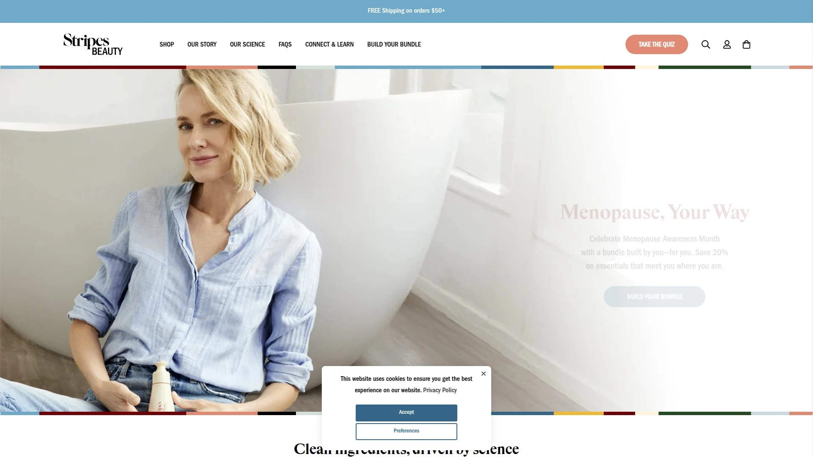

Stripes Beauty specifically targets menopausal and perimenopausal skin experiencing dramatic changes from hormonal shifts. Founded by actress Naomi Watts from personal experience, the brand comprehensively addresses skin, body, hair, intimate care, and supplements. Dew As I Do Moisturizer hydrates and brightens skin experiencing increased dryness and dullness from estrogen loss.

Holistic approach recognizes menopause affects entire body beyond face, offering solutions for every concern. Product development involves women experiencing these changes, ensuring formulations address real needs versus assumptions. The brand normalizes discussing menopause openly, reducing stigma around natural life stage.

**Educational resources** help women understand what's happening to their bodies and how products address specific changes. Community aspect connects women experiencing similar challenges, providing support beyond products. Comprehensive offerings let women address multiple concerns from single trusted brand.

Premium pricing reflects specialized formulations and founder's passion for the cause. The brand suits women in perimenopause and menopause wanting targeted solutions for this specific life stage. Stripes Beauty benefits those frustrated with generic anti-aging products not addressing hormonal changes.

## **[SkinCeuticals](https://www.skinceuticals.com)**

Medical-grade skincare with dermatologist-endorsed formulations.

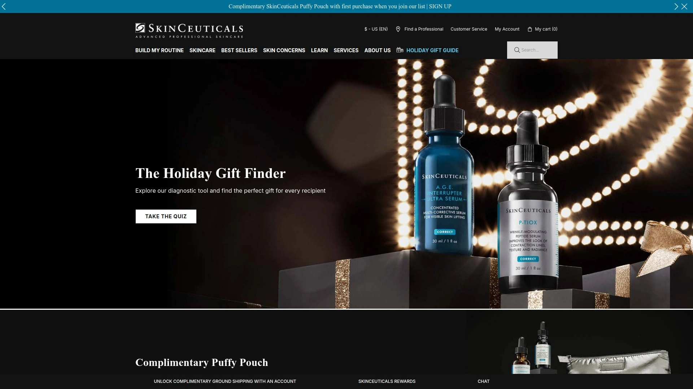

SkinCeuticals earns consistent dermatologist recommendations through scientific breakthroughs and clinical validation. C E Ferulic Serum combines 15% L-ascorbic acid, 1% alpha tocopherol, and 0.5% ferulic acid in antioxidant formulation protecting against environmental aging. A.G.E. Interrupter Ultra Serum targets advanced glycation end-products contributing to sagging and deep wrinkles.

Medical-grade positioning means products available through dermatology offices and authorized retailers ensuring authenticity. Double-patented formulas protect proprietary technology that competitors cannot duplicate. Clinical studies validate efficacy claims providing evidence-based confidence in results.

**Professional strength** concentrations deliver visible improvements though require proper introduction avoiding irritation. Dermatologists and plastic surgeons globally praise formulations as adjunct to in-office treatments. Price points reflect premium positioning with serums exceeding $180.

Layering protocols maximize benefits when using multiple products together synergistically. The brand suits mature women committed to best-in-class skincare willing to invest significantly. SkinCeuticals benefits those wanting medical-grade results without cosmetic procedures.

## **[Lancôme](https://www.lancome-usa.com)**

Iconic French luxury celebrating 90 years of beauty innovation.

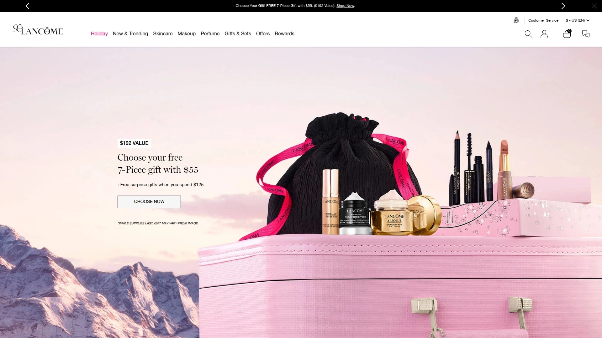

Lancôme's 90-year heritage combines with cutting-edge biotech ingredients targeting all aging signs. Génifique Ultimate Serum improves radiance, tone, pores, lines, smoothness, and softness while repairing damaged barriers. Absolue collection utilizes nearly every rose part, considered the brand's crown symbol, for luxurious anti-aging treatment.

Refillable packaging reduces waste while maintaining luxury experience. Department store availability provides testing opportunities and beauty advisor assistance. The brand's longevity demonstrates commitment to innovation and quality maintained across decades.

**Luxurious experience** extends beyond formulations to packaging, fragrance, and overall sensory enjoyment. Price points reflect luxury positioning though reputation justifies investment for quality-focused consumers. The brand suits mature women appreciating finer things valuing heritage and sophistication.

Comprehensive range addresses every skin concern from brightening to firming, hydration to texture. Makeup collections complement skincare for complete beauty routines from single trusted brand. Lancôme benefits women wanting proven luxury performance backed by decades of innovation.

## FAQ

**What ingredients should mature skin look for in cosmetics and skincare?**
Prioritize hyaluronic acid for hydration, peptides for firming, ceramides for barrier repair, retinol for cell turnover, and vitamin C for brightening. Mature skin benefits from formulations avoiding harsh ingredients that increase dryness while incorporating moisturizing elements like squalane and niacinamide. SPF protection remains essential preventing further sun damage that accelerates visible aging.

**How do I prevent makeup from settling into fine lines and wrinkles?**
Use hydrating primers creating smooth base, apply thin buildable layers rather than thick single application, and choose cream formulas over powder when possible. Avoid powder products emphasizing texture, instead opt for luminous finishes that blur rather than highlight imperfections. Set makeup with light misting spray rather than heavy powder application.

**Are expensive mature skin cosmetics worth the higher price?**
Luxury brands often incorporate higher concentrations of active ingredients and more sophisticated formulations delivering measurable results. However, accessible brands like IT Cosmetics, Laura Geller, and drugstore options from Olay or CeraVe provide excellent value for budget-conscious consumers. Consider investing in fewer high-quality items you'll actually use rather than numerous mediocre products.

## Choose Products Honoring Your Skin's Evolution

Mature skin cosmetics transform frustrating makeup application into confidence-building routine by addressing specific concerns like dryness, wrinkles, and texture changes rather than ignoring them. [Fièra Cosmetics](https://fieracosmetics.com) excels for women seeking reality-tested formulas developed specifically for mature skin concerns, with over one million women confirming products don't settle into lines, concealer doesn't crease, and skincare actually improves appearance over time rather than just covering temporarily. Choose brands matching your priorities whether clean ingredients, clinical efficacy, luxury experience, or budget-friendly performance, then enjoy makeup that enhances your natural beauty at every age.
